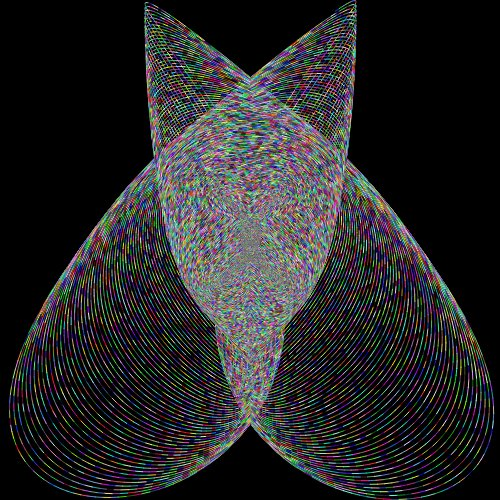

# Rama RandomArt
En esta rama podrás encontrar las obras creadas al simular un armonógrafo espectral en python gracias a la librería pygame entre otras, a continuación una breve descripción del contenido.

* Carpeta Random: Contiene un conjunto de imágnes generadas con el armonógrafo espectral
* Generator.py: Código con el armonógrafo que genera las obras artísticas (ejemplos de estas se encuentran en la carpeta Random)
* Rename.py: Función para colocar nombres adecuados a las obras artísticas. Inicialmente los archivos generados tenian nombres arbitrarios que no ayudaban a su distinción, sin embargo, en desarrollos posteriores se logró asignarles nombres más dicientes en el archivo Generator.py por lo que este script actualmente no es necesario. 

